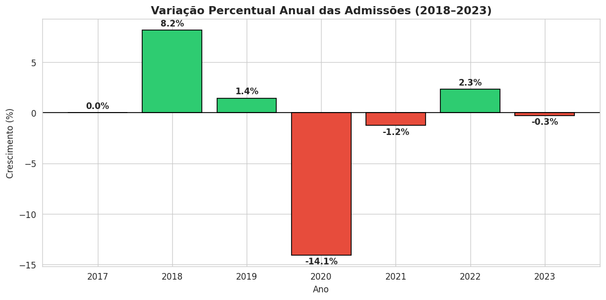
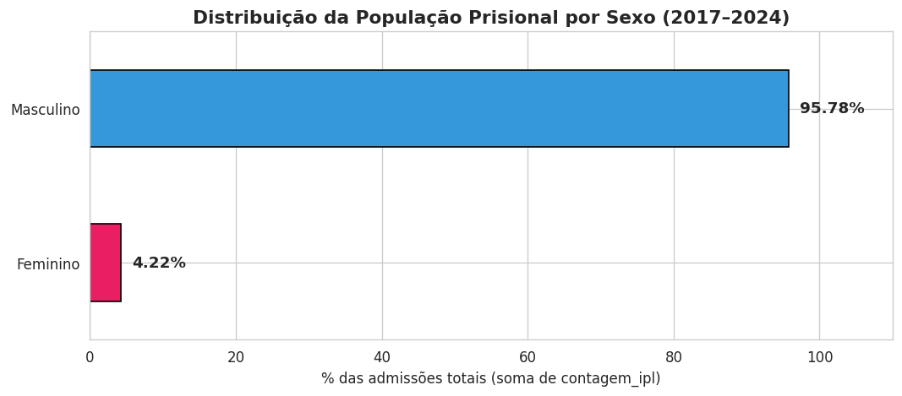
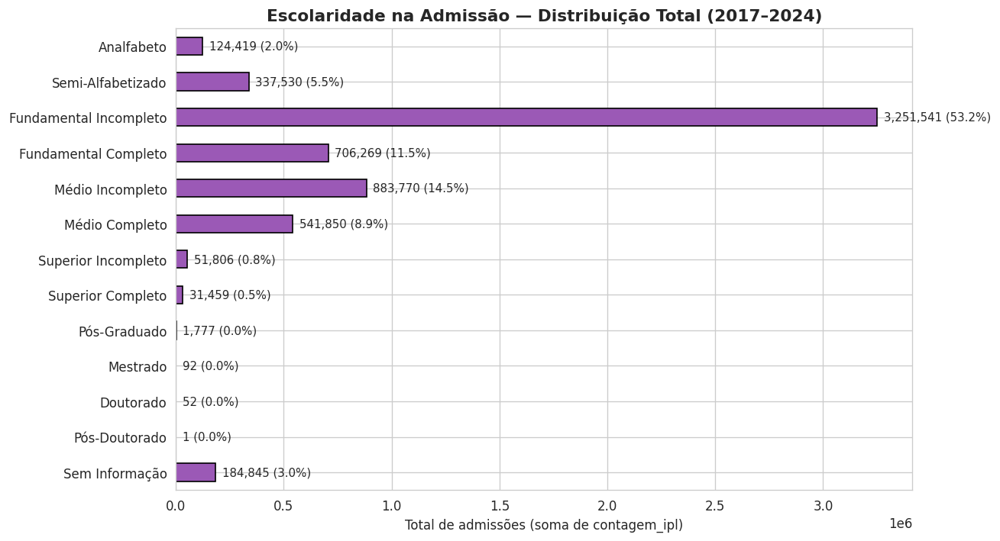
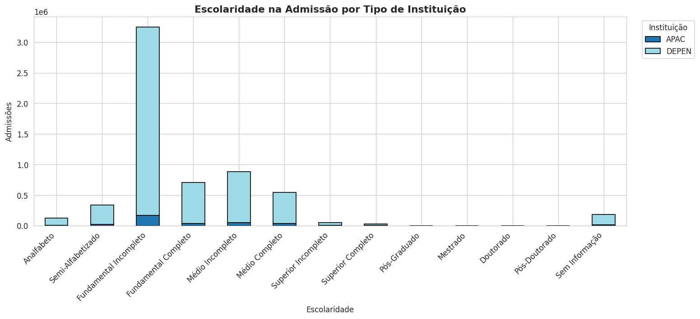
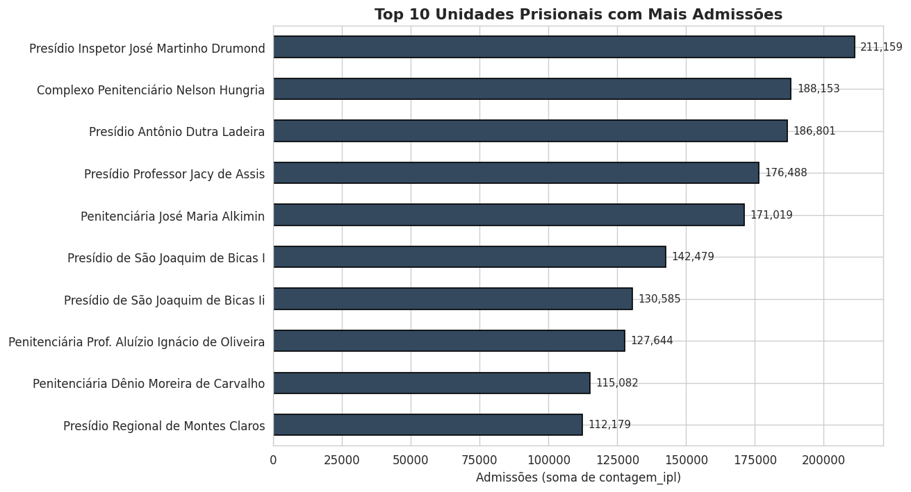

# 🔎 Análise da População Prisional de Minas Gerais (2017–2024)


---

## 🧭 Como surgiu esse projeto

Procurando um tema **próprio** para praticar análise de dados, pensei: por que não trabalhar com algo que realmente importa? Encontrei dados públicos sobre a população prisional de Minas Gerais, disponibilizados pela Secretaria de Estado de Justiça e Segurança Pública, e decidi mergulhar.

A pergunta que me guiou foi simples: **quem está sendo admitido no sistema prisional de Minas Gerais, e o que esses dados podem revelar sobre as desigualdades sociais por trás dele?**

Esse projeto é exploratório, descritivo e honesto sobre seus limites. Não pretende explicar causas — pretende **mostrar padrões** que podem alimentar discussões mais informadas sobre segurança pública e políticas prisionais.

---

## 🎯 Perguntas de análise

- Como evoluiu o volume de admissões ao longo dos anos?
- Qual é a distribuição por **sexo** das pessoas admitidas?
- Qual é o **nível de escolaridade** predominante?
- Há **concentração geográfica** ou em unidades específicas?

---

## 📂 Os Dados

Trabalhei com dados abertos do **Observatório de Segurança Pública de Minas Gerais**, cobrindo o período de **janeiro de 2017 a junho de 2024** — quase 8 anos de admissões no sistema prisional estadual.

**Fonte:** [Secretaria de Estado de Justiça e Segurança Pública de MG](https://www.seguranca.mg.gov.br/index.php/component/sppagebuilder/page/266)

**Dimensão original:** 328.773 registros × 15 colunas
**Após limpeza:** 284.627 registros (44.146 duplicatas removidas)

Cada registro descreve uma combinação de **estabelecimento prisional**, **município**, **RISP** (Região Integrada de Segurança Pública), **sexo na admissão**, **nível de escolaridade**, **ano** e **mês**, com o número real de admissões na coluna `CONTAGEM_IPL`.

> ⚙️ **Nota metodológica:** Como cada linha agrega múltiplas admissões na coluna `CONTAGEM_IPL`, **todos os percentuais neste projeto foram calculados com a soma dessa coluna**, e não com a contagem de linhas. Calcular pela contagem de linhas levaria, por exemplo, a um número de 76% para a participação masculina — enquanto o número real (somando admissões) é 96%.

---

## 🔄 Pipeline da Análise

```
📥 Carregamento da base bruta (328.773 registros)
        │
        ▼
🧹 Limpeza
   Remoção de 44.146 duplicatas exatas → 284.627 registros
   Padronização de nomes de colunas (lowercase + underscore)
        │
        ▼
🛠️  Engenharia de variáveis
   Criação de data_completa (ano + mês)
   Separação correta de Fundamental e Médio na escolaridade
        │
        ▼
📊 Análise exploratória
   Evolução temporal · Distribuição por sexo · Escolaridade
   Cruzamento instituição × escolaridade · Análise regional
        │
        ▼
💡 Insights & Limitações
```

---

## 📈 Principais Descobertas

### 1. Variação anual: 2020 foi o ano da grande queda



Considerando apenas anos completos (2017–2023, com 2024 excluído por ter dados apenas até junho), as admissões oscilaram da seguinte forma:

| Ano | Admissões | Variação |
|---|---|---|
| 2017 | 823.019 | — |
| 2018 | 890.063 | **+8,15%** |
| 2019 | 903.006 | +1,45% |
| 2020 | 776.083 | **–14,06%** |
| 2021 | 766.357 | –1,25% |
| 2022 | 784.292 | +2,34% |
| 2023 | 782.217 | –0,26% |

A queda de **–14% em 2020** chama atenção. Coincide com o período inicial da pandemia de COVID-19, possivelmente refletindo **políticas excepcionais de redução de aglomeração carcerária** adotadas nacionalmente. Depois disso, o volume estabilizou em patamar inferior ao pré-pandemia.

---

### 2. Desigualdade de gênero estrutural



A população prisional admitida em Minas Gerais é composta por **95,78% de homens** e **4,22% de mulheres**, considerando o total real de admissões no período. Esse padrão se mantém estável de 2017 a 2024.

Não é um pico recente, é uma característica estrutural do sistema — consistente com dados nacionais e internacionais sobre encarceramento.

---

### 3. Baixa escolaridade concentra a maioria das admissões



A distribuição educacional é fortemente desigual. Somando as categorias **Analfabeto + Semi-Alfabetizado + Fundamental Incompleto + Fundamental Completo**, a fatia ultrapassa **60% das admissões**.

No outro extremo, as categorias de ensino superior (Incompleto, Completo, Pós-Graduado, Mestrado, Doutorado) representam **menos de 10%** do total.

> 💡 **Importante:** esse padrão **não prova causalidade** entre baixa escolaridade e ingresso no sistema prisional. Mas evidencia forte associação com vulnerabilidade socioeducacional — uma janela para discutir desigualdade estrutural antes mesmo do sistema penal.

---

### 4. DEPEN domina, APAC é minoria



Comparando as duas modalidades institucionais:

- **DEPEN** (Departamento Penitenciário — modelo tradicional): concentra a grande maioria das admissões
- **APAC** (Associação de Proteção e Assistência aos Condenados — modelo alternativo, com foco em ressocialização): participação minoritária

O padrão de escolaridade é semelhante entre as duas — ambas concentram admissões nas faixas mais baixas de instrução formal.

---

### 5. Concentração institucional e regional



A **Penitenciária Prof. Aluízio Ignácio de Oliveira**, em Ribeirão das Neves, lidera o ranking de admissões. As 10 unidades com maior volume concentram uma fatia significativa do total — segue um padrão semelhante ao princípio de Pareto: poucas unidades respondem pela maior parte do volume.

Geograficamente, há forte concentração na **região metropolitana de Belo Horizonte** e nas RISPs de Ipatinga (8,73%), Juiz de Fora (8,01%) e Divinópolis (7,81%), que juntas somam mais de 24% das admissões do estado.

---

## 🧠 O Que Aprendi

- **Soma ≠ contagem.** Quando cada linha do dataset representa uma combinação demográfica com um campo de "quantidade", calcular percentual por `value_counts()` produz um número diferente de calcular com `groupby().sum()`. A diferença entre **95,78%** (real) e **76,15%** (linhas) escancara o tamanho do erro.
- **Padronizar categorias exige conhecimento de domínio.** No primeiro draft, eu havia fundido "1.Grau" e "2.Grau" sob o rótulo "Fundamental" — mas 2.Grau é **Ensino Médio**, não Fundamental. Detalhe pequeno, distorção grande.
- **Anos parciais são tóxicos para análises de variação.** Excluir 2024 da análise de crescimento foi necessário — comparar 6 meses com 12 meses de outros anos não faria sentido.
- **A coluna que conta a história nem sempre é óbvia.** Aqui foi `CONTAGEM_IPL`, não cada registro.

---

## 🚧 Desafios

- **Volume:** 328 mil linhas iniciais. Foi a primeira vez que precisei pensar em performance e memória de fato.
- **Qualidade de dado público:** padronização inconsistente, codificações variadas, categorias com nomes em maiúsculas e minúsculas misturadas.
- **Decidir o que descartar:** os 44 mil registros duplicados removidos foram cerca de 13% do total. Precisei confirmar que eram duplicatas exatas, não casos legítimos com mesmas características.
- **Equilibrar análise descritiva e narrativa social** sem extrapolar para conclusões causais que os dados não suportam.

---

## ⚠️ Limitações

A análise é **exploratória e descritiva**. Conscientemente, não há:

- Variáveis socioeconômicas complementares (renda, ocupação, raça/cor)
- Informação sobre reincidência ou tempo de permanência
- Aplicação de modelos inferenciais ou preditivos
- Análise causal — apenas associação observada nos dados

Esses limites não são falhas, são fronteiras honestas do que essa base permite responder.

---

## 🛠 Tecnologias

| Ferramenta | Uso |
|---|---|
| **Python 3.10** | Linguagem principal |
| **Pandas / NumPy** | Manipulação de 280k+ registros |
| **Matplotlib & Seaborn** | Visualizações exploratórias |
| **Google Colab** | Ambiente de execução |

---

## 📂 Estrutura do Repositório

```
📦 analisededados_populacaoprisionalMG_2017a2024
 ┣ 📓 analise_populacaoprisionalMG_2017_2024.ipynb
 ┣ 🖼️ 01_variacao_anual.png
 ┣ 🖼️ 02_distribuicao_sexo.png
 ┣ 🖼️ 03_escolaridade.png
 ┣ 🖼️ 04_instituicao_escolaridade.png
 ┣ 🖼️ 05_top10_unidades.png
 ┗ 📄 README.md
```

---

## ▶️ Como Executar

```bash
# 1. Clone o repositório
git clone https://github.com/danielli-arcari/analisededados_populacaoprisionalMG_2017a2024.git

# 2. Instale as dependências
pip install pandas numpy matplotlib seaborn jupyter openpyxl

# 3. Baixe o dataset no portal da SEJUSP e ajuste o caminho no notebook
# 4. Abra o notebook
jupyter notebook analise_populacaoprisionalMG_2017_2024.ipynb
```

Ou acesse diretamente no [Google Colab](https://colab.research.google.com/drive/1ESr8ZIiVcNlW785A_7c3kQjfPLPLXbCu?usp=sharing).

---

## 💭 Por que isso importa

Dados sobre população prisional costumam ser números abstratos nas notícias. Quando você senta e analisa, vê pessoas: **quase 6 milhões de admissões em 7 anos** em um único estado. Entender o perfil — quem entra, com qual escolaridade, em qual região — ajuda a ter conversas mais informadas sobre segurança pública, reabilitação e políticas prisionais.

E ajuda a perceber que, por trás de cada estatística, há uma história de exclusão social que começou muito antes do sistema penal.

---

## 👩‍💻 Autora

**Danielli Meilene Coutinho Arçari**

Graduanda em Ciência da Computação (UNINTER), em transição para a área de Dados. Apaixonada por usar dados para investigar fenômenos sociais e gerar reflexões úteis.

[](https://www.linkedin.com/in/danielli-arcari/)
[](https://github.com/danielli-arcari)
[](https://danielliarcari.vercel.app/)
